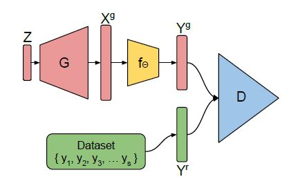
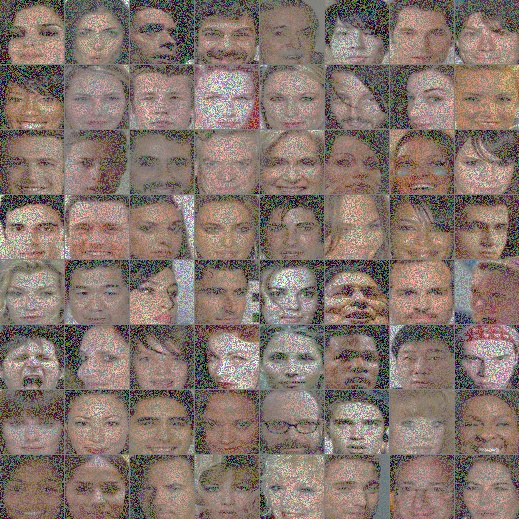
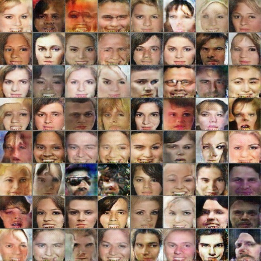
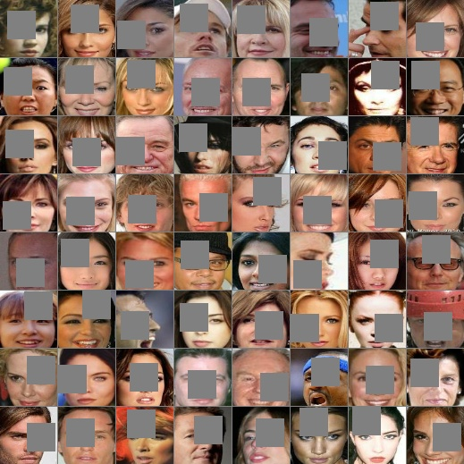
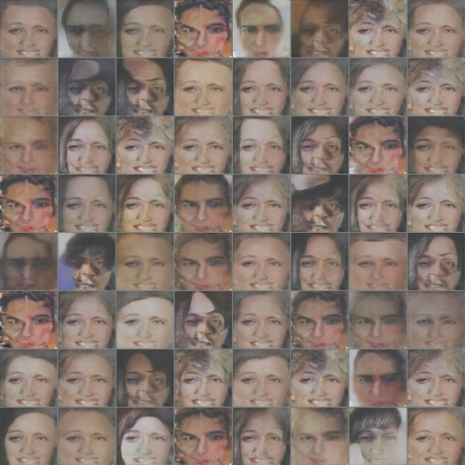
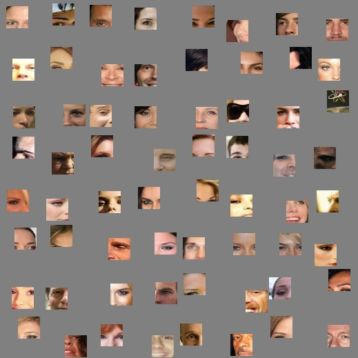
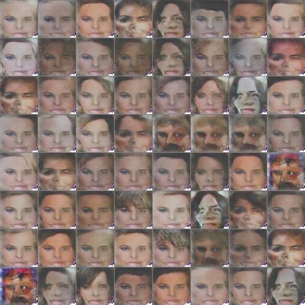
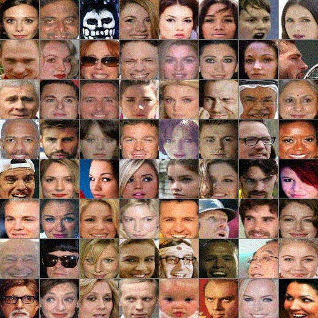

# Tensorflow implementation of AmbientGAN
Tensorflow implementation of [AmbientGAN](https://openreview.net/forum?id=Hy7fDog0b).  
The model proposed in this paper learns an implicit generative model given only lossy measurement models. It doesn't have access to fully-observed samples, and yet it recovers true underlying distribution.  

## Network  
<p align="center"></div>  

### Folder setting
```
-data
  -img_align_celeba
    -img1.jpg
    -img2.jpg
    -...
```
## Measurement models
* block_pixel : Each pixel is independently set to zero with probability p.  
* block_patch : A randomly chosen k × k patch is set to zero.  
* keep_patch : All pixels outside a randomly chosen k × k patch are set to zero.  
* conv_noise: k sized gaussian kernel is convolved and noise is added from the distribution Θ ∼ pθ.   

## Requirements
* python 2.7
* Tensorflow 1.4
* numpy
* cv2 (to save image tile)


## Training
```
$ python train.py --measurement=block_pixel
```

To continue training  
```
$ python train.py --measurement=block_pixel --continue_training=True
```


## Block-Pixels

***Trained CelebA images (pixels blocked with p=0.5)***  


***Results***  
  
  
 


## Block-Patch

***Trained CelebA images (randomly blocked 32x32 patch)***  
  

***Results***  
  
  
 

## Keep-Patch

***Trained CelebA images (randomly kept 32x32 patch)***  
  

***Results***  
  
  
 


## Convolve+Noise  

***Trained CelebA images (gaussian filter + noise(stddev=0.1))***  
  

<!-- ***Results***  
  
   -->
## ToDo
* Train Convolve+Noise


